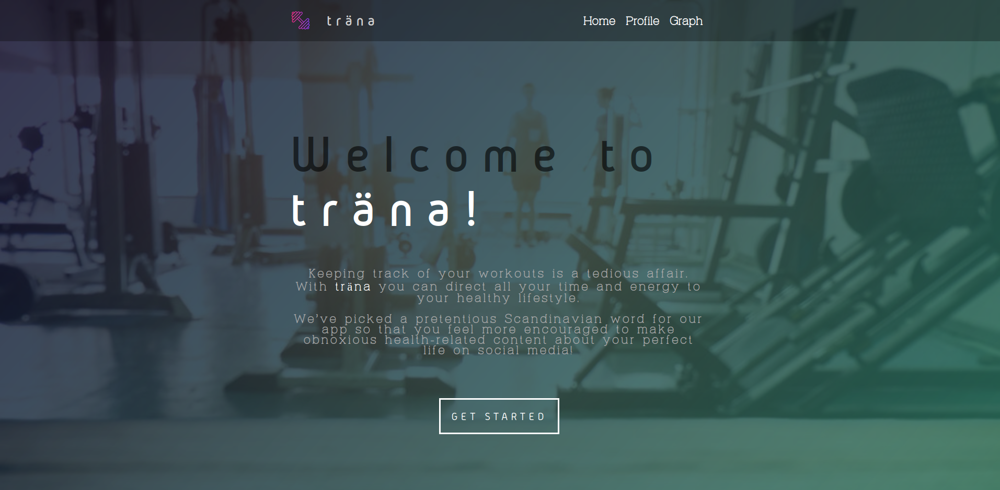
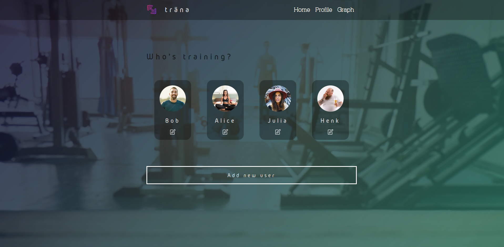
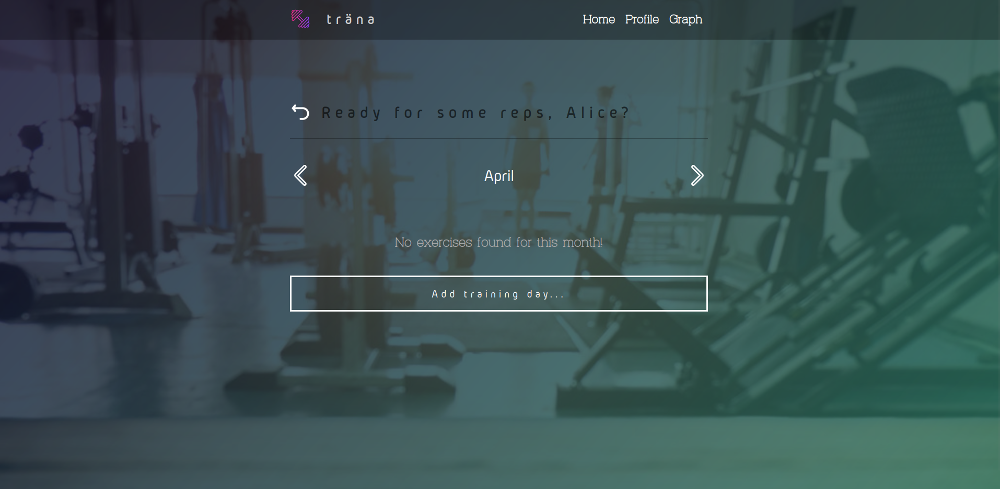
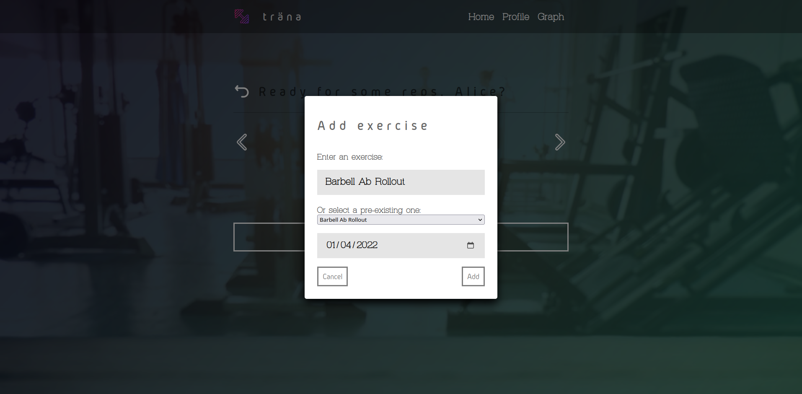
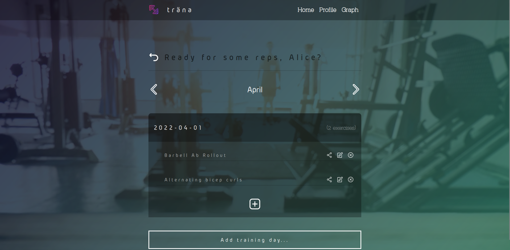

# Träna

## Introduction

My submission for the SPA exam project of Associate's Degree Software Development at Saxion. I'm not allowed to describe the exact objectives of the project, only that we had 3 days to create a clientside webapp that interacts with a backend API made from scratch. I used Express for the backend, and the Svelte framework for the frontend. I received an 8.1 for the project.

## Goal of the application

As stated on the introduction page:

> Keeping track of your workouts is a tedious affair. With **träna** you can direct all your time and energy to your healthy lifestyle. We've picked a pretentious Scandinavian word for our app so that you feel more encouraged to make obnoxious health-related content about your perfect life on social media!

Introduction page:

Selecting a profile:

Viewing a month:

Adding an exercise:

Viewing a month with entered exercises:

## Instructions

The backend and frontend should be run separately. I included a shell script for this, use `run.sh --help` for futher instructions.

## Cypress Tests

To run the Cypress backend test, run `npx cypress open` in the `backend` folder.

To run the Cypress frontend e2e test, run `npx cypress open` in the `frontend` folder.

## Reset database

curl -X PUT localhost:3000/reset_database

## Credits

For adding pre-defined exercises, this application makes use of `https://wger.de/api/v2/exercise`.